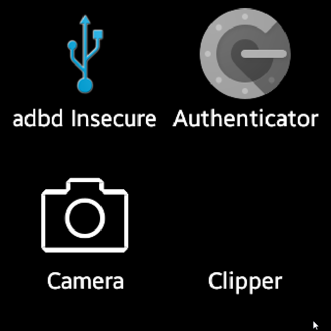

# FreeOTP to Google Authenticator 5.00

This script allows you to transfer your FreeOTP+ tokenss to a ROOTED android device, such as a Samsung Gear, using Google Authenticator.

This is also intended to be used with Samsung Gears or other Android based watch devices. You will also need a rooted device

This was tested with a Samsung Gear 1 (SM-v700). If you have one and want to root one, look up a root guide, and when you go to download Cydia Impactor, download version 0.9.14, otherwise you'll get an invalid package error. (You can find a different version somewhere on the interwebs.)

This is intended to work with Google Authenticator Version 5.00 which is compatible with Android 2.4 and up.

GA will be used for short for Google Authenticator

## Prerequisites

1. Your FreeOTP+ JSON export, renamed to `freeotp.json` and placed in the root folder of the repo
1. You'll need `eu.chainfire.adbd` installed on your device. Just look it up and find the apk, or buy it on the google play store.
1. You'll also need a specific version of [Google Authenticator, version 5.00](https://apkpure.com/google-authenticator/com.google.android.apps.authenticator2/download/5.00)
1. This repository

## Instructions

Open a new command prompt or shell

1. Install adbd

    ```sh
    adb install "eu.chainfire.adbd.apk"
    ```

1. Install the GA you downloaded from somewhere

    ```sh
    adb install "'Google Authenticator_5.00_Apkpure.apk"
    ```

1. Open GA on your device once. Go through the setup, then once it prompts you to add a key, you can exit the app. (We'll make sure its dead later, we just need to do this for the app to initalize the database)

1. Clone this repository

    ```sh
    git clone https://github.com/flleeppyy/freeotp-to-google-authenticator
    cd freeotp-to-google-authenticator
    ```

1. Install dependencies

    ```sh
    npm install
    ```

1. On your device, open "adbd Insecure"

    

1. Scroll down until you see "Enable insecure adbd" and "Enable at boot". Check both of those boxes, granting any root requests from SuperSU

    

1. Go back to your shell/commamnd prompt. We'll need to kill GA via root
    > This is where you start if you just want to update your OTP codes with GA on the device.

    ```sh
    adb shell su
    ps | grep com.google.android.apps.authenticator2
    # You should get something like this:
    u0_a55    23065 1447  505420 37884 ffffffff 4012eef4 S com.google.android.apps.authenticator2
    # Grab the first series of numbers in the line you get. In this instance: 23065
    kill 23065
    # If nothing showed up, great! The app's dead.
    ```

1. Pull GA's database file into the repository.

    ```sh
    adb pull /data/data/com.google.android.apps.authenticator2/databases/databases
    ```

1. Next we'll run our script. Make sure you exported your FreeOTP+ backup to json, and renamed it to `freeotp.json`

    ```sh
    node index.js
    ```

1. After the script has run and the database has been updated with our freeotp backup, we'll push the database back onto the device.

    ```sh
    adb push databases /data/data/com.google.android.apps.authenticator2/databases/databases
    ```

## I just want to update my OTP codes to GA

Read the last 4 steps in the instructions, or run `runall.ps1` or `runall.sh` depending on your system.

These two scripts kill GA via ADB, pull GA's database, run the script, then push the database back to the device.
